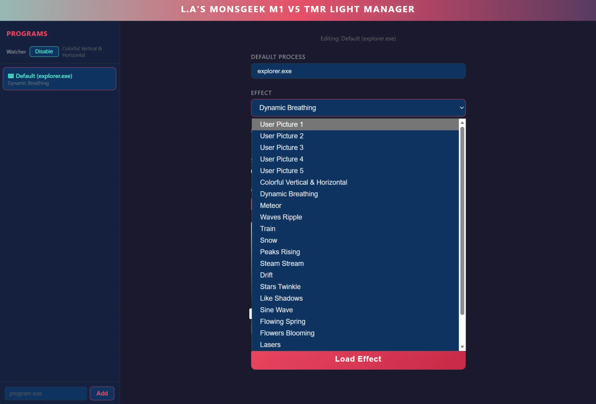
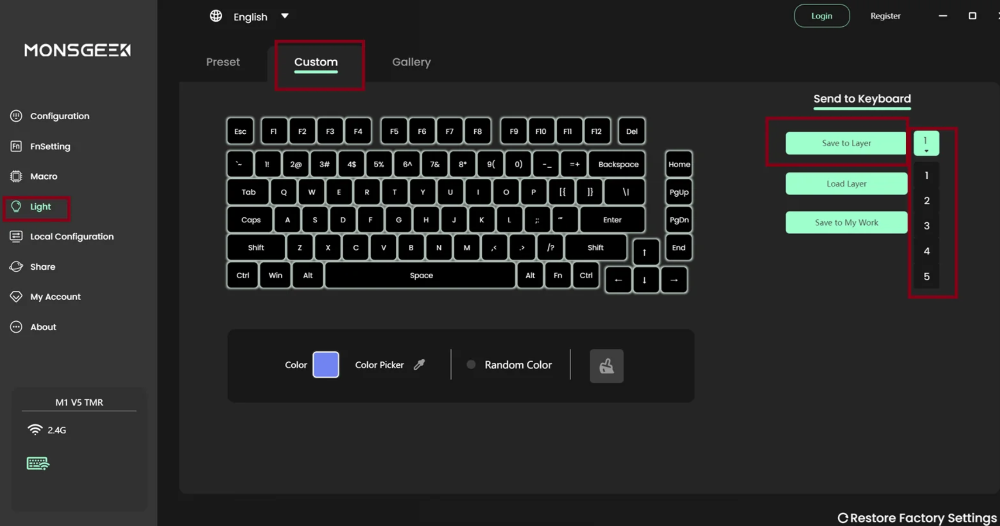
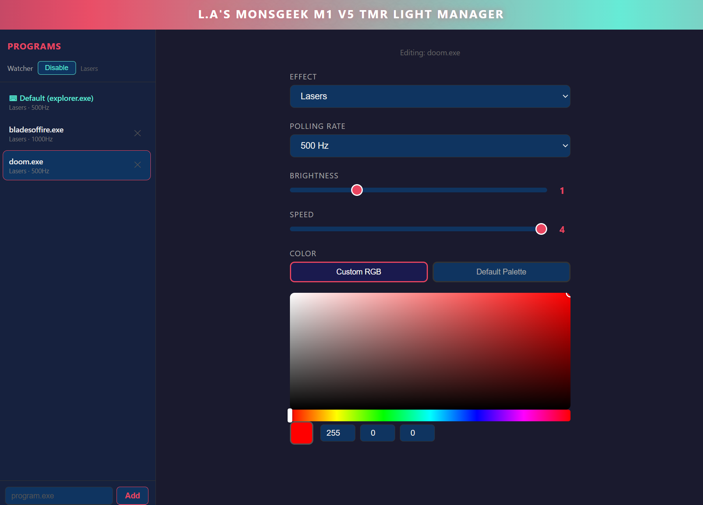
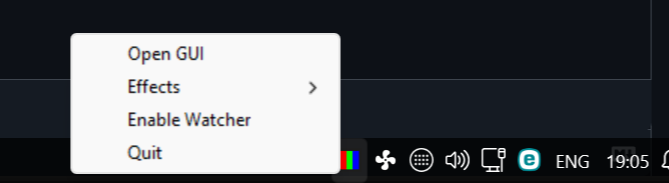

# MonsGeek M1 V5 RGB Manager

A lightweight utility designed to automate RGB lighting profiles for your keyboard based on active applications. 

## Screenshots

*Figure 1: Main GUI showing different light effects you can choose from in the default state.*

*Figure 2: The Picture 1,2,3,4,5 corresponds to this part in the MonsGeek APP.*

*Figure 3: Main GUI showing different light effects you can choose from + their settings for a specific app.*

*Figure 4: Tray icon menu for accessing the web GUI.*

---

## How it Works
This tool uses reverse-engineered USB commands to interface directly with the keyboard firmware. It monitors active processes and updates the `keyboard_config.json` file to trigger the desired lighting effect.

## Usage
1. Run `m1v5trm_light_manager.exe`.
2. The program will minimize to your system tray.
3. Click the tray icon to launch the Web-based GUI.
4. Associate your preferred apps with specific lighting profiles if you want.

**Technical Notes:**
* **Debug Mode:** Run the executable with the `--debug` flag if you need to generate logs.
* **Compatibility:** This tool supports both wired and wireless modes with automatic detection.
* **Stability:** This utility interacts directly with hardware protocols. While I have used this personally without issue, **use this tool at your own risk.** If MonsGeek updates their drivers, functionality may be affected.

## Installation & Development
* The `m1v5trm_light_manager.exe` is automatically compiled from the `server.py` script located in this repository.
* For the latest updates, source code, and release builds, visit the GitHub repository: 
  [Link to lanaf-home/m1-v5-tmr-light-manager](https://github.com/lanaf-home/m1-v5-tmr-light-manager)

---
*Disclaimer: This is an unofficial, community-developed project. I am not responsible for any hardware issues that may arise from its use.*
