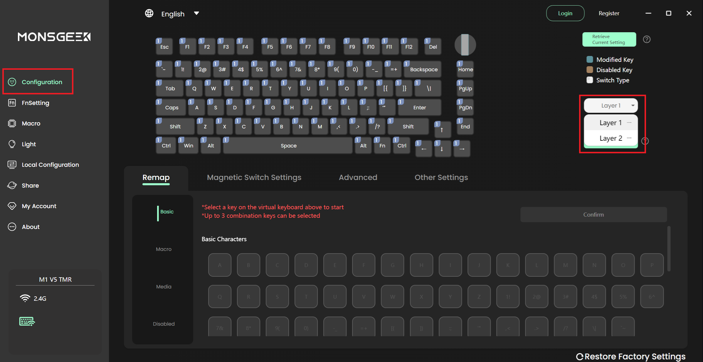

# MonsGeek M1 V5 TMR Light Manager

A lightweight utility designed to automate RGB lighting profiles and USB polling rate for your keyboard based on active applications. 

## Screenshots

*Figure 1: Main GUI showing different light effects you can choose from in the default state.*
   

*Figure 2: The Picture 1,2,3,4,5 corresponds to this part in the MonsGeek APP.*
   

*Figure 3: Main GUI showing app specific settings (for example doom.exe).*
   

*Figure 4: Profile 1 and Profile 2 match the Layer1/Layer2 in the MonsGeek APP (which is fn+F9/F10).*
   

*Figure 5: Tray icon menu for accessing the web GUI. Left click to open GUI, right click to open quick settings.*
   

---

## How it Works
This tool uses reverse-engineered USB commands to interface directly with the keyboard firmware. It monitors active processes and updates the `keyboard_config.json` file to trigger the desired lighting effect and polling rate.

## Features
* **RGB Lighting Profiles** — Choose from 23 lighting effects with customizable brightness, speed, and color.
* **USB Polling Rate Control** — Set the keyboard polling rate per profile: 125, 250, 500, 1000, 2000, 4000, or 8000 Hz.
* **Per-Application Profiles** — Automatically switch both lighting and polling rate when specific apps are in focus.
* **System Tray** — Quick access to effects and polling rate from the tray icon right-click menu.

## Usage
1. Run `m1v5tmr_light_manager.exe`.
2. The program will minimize to your system tray.
3. Click the tray icon to launch the Web-based GUI.
4. Associate your preferred apps with specific lighting profiles and polling rates.
5. Change polling rate on the fly from the GUI dropdown or the tray icon's **Polling Rate** submenu.

**Technical Notes:**
* **you might need to run as admin**.
* **Debug Mode:** Run the executable with the `--debug` flag if you need to generate logs.
* **Compatibility:** This tool supports both wired and wireless modes with automatic detection.
* **Stability:** This utility interacts directly with hardware protocols. While I have used this personally without issue, **use this tool at your own risk.** If MonsGeek updates their drivers, functionality may be affected.

## Installation & Development
* The `m1v5tmr_light_manager.exe` is automatically compiled from the `server.py` script located in this repository.
* For the latest updates, source code, and release builds, visit the GitHub repository: 
  [Link to lanaf-home/m1-v5-tmr-light-manager](https://github.com/lanaf-home/m1-v5-tmr-light-manager)

---
*Disclaimer: This is an unofficial, community-developed project. I am not responsible for any hardware issues that may arise from its use.*
